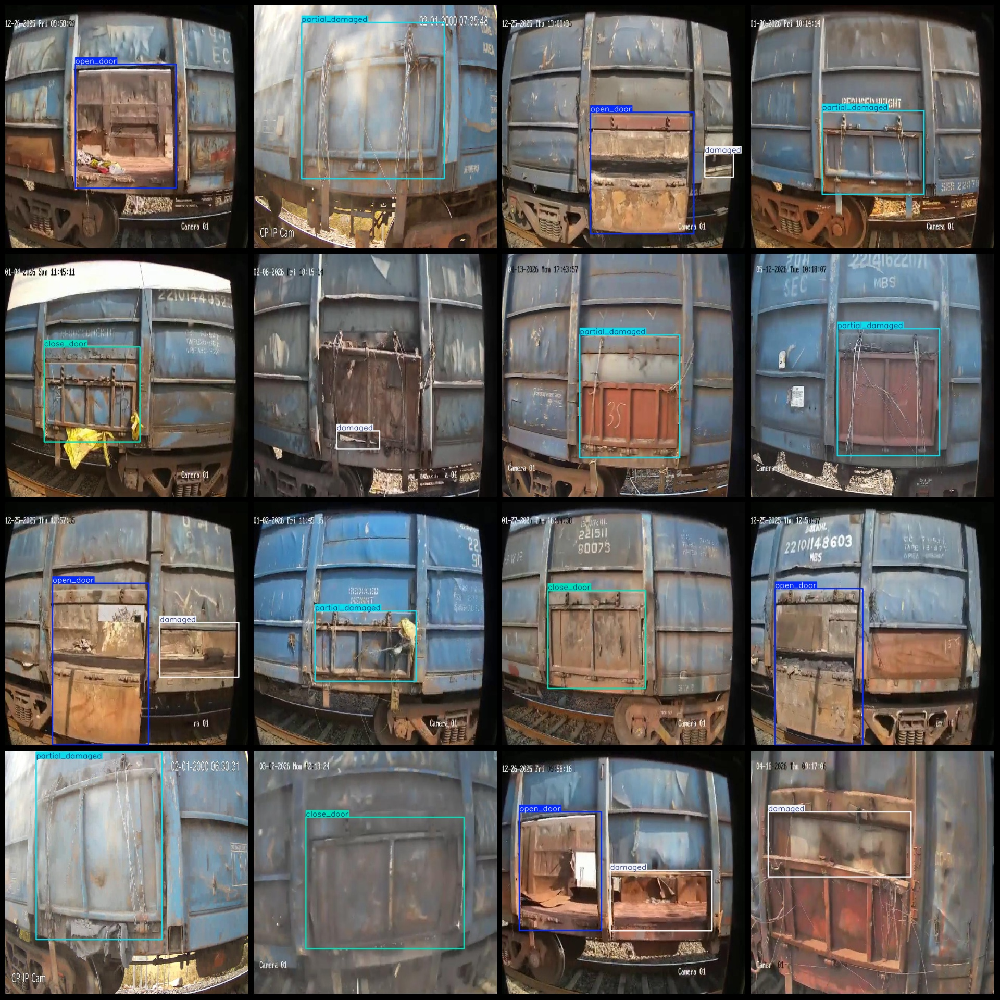
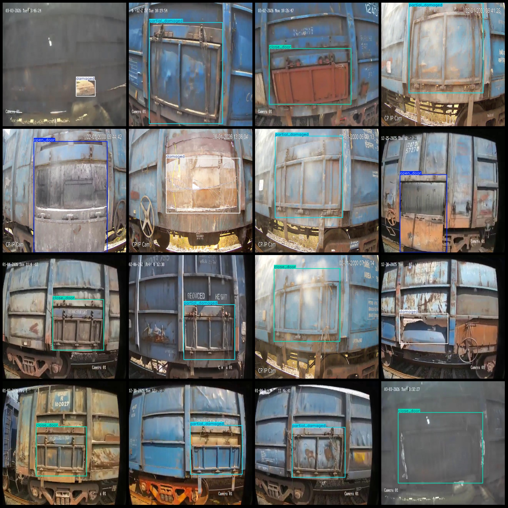

# Training dataset for train VOC+YOLO with 2101 images in 4 categories

The dataset format follows the Pascal VOC format plus YOLO format (excluding the segmentation path in the txt file, only containing jpg images along with their corresponding VOC format xml files and 
YOLO format txt files).

Number of images (jpg file count): 2101
Number of annotations (xml file count): 2101
Number of annotations (txt file count): 2101
Number of annotation categories: 4
Annotation category names (note that the order of categories in the YOLO format does not correspond to this, but is based on the labels folder's classes.txt): ["close_door", "damaged", "open_door", 
"partial_damaged"]

Box counts per category:
- close_door boxes = 428
- damaged boxes = 717
- open_door boxes = 451
- partial_damaged boxes = 681
Total box count: 2277

Images per category:
- close_door images = 428
- damaged images = 635
- open_door images = 451
- partial_damaged images = 681

Image resolution: 640x640

Annotation tool used: labelImg
Annotation rules: draw a bounding box around the category

Important note: The dataset does not have been split into training, validation, or test sets; you must do so yourself.

Special declaration: This dataset does not guarantee any accuracy for models trained on it or weight files.

Image previews:

Annotation example:
## Image

Here is a pay link on Stripe ( https://buy.stripe.com/3cs8yP7sY87d0vu9AB ). Please contact me lonlonago@foxmail.com after funding $89, and I will send you a complete data files , thank you!

